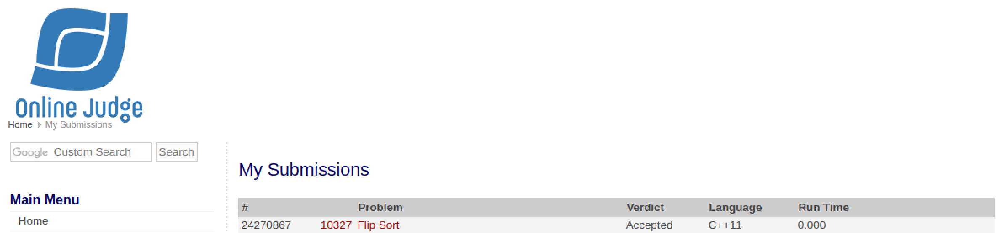

# [Flip Sort](https://onlinejudge.org/external/103/10327.pdf)

## Veredito do Código



## Respostas

Gabarito dos inputs fornecidos

### [Input 01](input1.txt)

Caso de teste retirado da própria questão

```txt
Minimum exchange operations : 0
Minimum exchange operations : 2
```

### [Input 02](input2.txt)

Caso de teste retirado do [uDebug](https://www.udebug.com/UVa/10327)

```txt
Minimum exchange operations : 6
Minimum exchange operations : 16
Minimum exchange operations : 0
Minimum exchange operations : 19
Minimum exchange operations : 485
```

### [Input 03](input3.txt)

Caso de teste retirado do [uDebug](https://www.udebug.com/UVa/10327)

```txt
Minimum exchange operations : 8
Minimum exchange operations : 2
```
